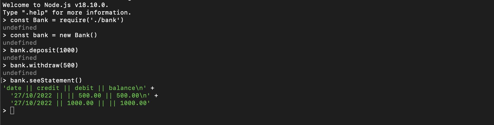

#Bank tech app

This app allows the user or the bank to store bank transactions and produce a statement report with the dates and the balances after each transaction.

##Installation:
Download this repo and run 

`npm install`

To run tests run 

`jest`

To run the program use node REPL 

`node`

##For example of how to run the program see file run.js

##Desription of the classes:

The transactions are stored as instances of the Transaction class, each transaction has a value and a date. By default the transactions are deposits and have a positive value, in order to indicate that a transaction is a withdrawal, isDebit method should be applied to the given transaction.

All transactions are stored in a list in the instance of an Account class. To link a transaction with the given Account, run a addTransaction method passing a given transaction as an argument. To display all transactions run the showTransactions method.

The Statement class calculates the balance and displays the statement. To print the statement create a new instance of the Statement class and run printStatement method.

#Have fun!